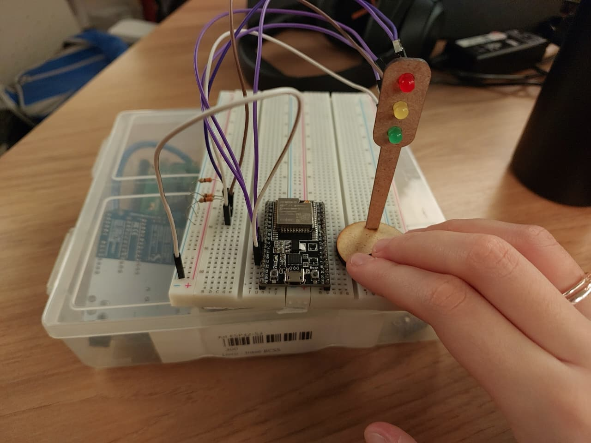

# Iot - Módulo 1 - Terceira Aula

Este projeto desenvolvido na 3 semana do módulo 4 tem como objetivo simular o funcionamento de um semáforo em uma via movimentada do bairro Butantã. A atividade envolve a montagem física do circuito com LEDs e resistores, além da programação da sequência de luzes para garantir a segurança de pedestres e veículos.

Montar um semáforo em protoboard utilizando LEDs vermelho, amarelo e verde, e programar o ciclo de funcionamento com tempos definidos para cada fase. O projeto também busca organizar os componentes de forma clara, validar a temporização das luzes e aplicar boas práticas de programação.

## Parte 1 - Montagem Física do Semáforo

Nesta etapa, foi realizada a montagem física de um semáforo utilizando uma protoboard, LEDs e resistores. O objetivo foi representar as três fases do semáforo convencional: vermelho, amarelo e verde, garantindo a proteção dos componentes e a organização dos fios para facilitar a visualização.

### Esquema de Montagem

**Imagem do circuito montado:**

*Figura 1: Foto real do projeto montado na protoboard com ESP32, LEDs e resistores.*

**Vídeo demonstrando o funcionamento:**
<video src="semafarouu.mp4" controls width="480">Seu navegador não suporta a tag de vídeo.</video>
*Figura 3: Demonstração em vídeo do funcionamento do semáforo com ESP32.*

[Assista ao vídeo no YouTube](https://youtu.be/MZApSvRY7qk)

### Descrição da Montagem

- Os LEDs vermelho, amarelo e verde foram posicionados na protoboard, cada um representando uma fase do semáforo.
- Resistores foram conectados em série com cada LED para garantir a proteção contra sobrecorrente.
- Os fios foram organizados de forma clara, facilitando a identificação de cada componente e a manutenção do circuito.
- A disposição dos componentes seguiu o padrão de semáforo convencional, com o LED vermelho no topo, amarelo ao centro e verde na base.
- Os terminais dos LEDs foram conectados aos pinos digitais do ESP32, permitindo o controle individual de cada fase via programação.
- Devido à falta de jumpers coloridos, não foi possível seguir a convenção de cores nos fios, mas foi priorizada a organização para facilitar a visualização e manutenção do circuito.

### Tabela de Componentes Utilizados

| Componente      | Quantidade | Especificação         | Observação                |
|-----------------|------------|-----------------------|---------------------------|
| LED Vermelho    | 1          | 5mm                   | Indica fase de parada     |
| LED Amarelo     | 1          | 5mm                   | Indica atenção            |
| LED Verde       | 1          | 5mm                   | Indica fase de passagem   |
| Resistores      | 3          | 330Ω, \(\pm \)5%     | Proteção dos LEDs         |
| Protoboard      | 1          | Padrão                | Montagem do circuito      |
| Fios Jumper     | Diversos   | Diversos          | Conexão dos componentes   |
| ESP32           | 1          | DevKit      | Controle do semáforo      |

### Justificativa das Conexões

Cada LED foi conectado a uma porta digital do ESP 32, permitindo o controle individual das fases do semáforo por meio da programação. Os resistores foram utilizados para limitar a corrente elétrica, evitando danos aos LEDs. A organização dos fios seguiu o objetivo de facilitar a visualização e a identificação rápida de cada componente, conforme solicitado na atividade.

## Parte 2 - Programação e Lógica do Semáforo

Nesta etapa, foi desenvolvida a programação responsável pelo funcionamento do semáforo, garantindo que as fases vermelho, verde e amarelo alternem conforme os tempos definidos. O código utilizado está disponível no arquivo [`semafaro_pntr.ino`](semafaro_pntr.ino), onde foi implementada a lógica utilizando ponteiros para controle dos pinos dos LEDs e dos tempos de cada fase.

A lógica do semáforo segue o padrão convencional, aproveitando os recursos do ESP32:
- O LED vermelho permanece aceso por 6 segundos, indicando parada.
- O LED verde permanece aceso por 4 segundos, permitindo passagem.
- O LED amarelo permanece aceso por 2 segundos, sinalizando atenção para mudança de fase.
- O ciclo é repetido continuamente, simulando o funcionamento real de um semáforo.

Para garantir a precisão da temporização, o funcionamento do semáforo foi testado utilizando um cronômetro de um celular, validando que cada fase respeita os tempos definidos. As transições entre as luzes foram observadas para assegurar que seguem a ordem correta e que o sistema opera de forma contínua e segura.

O código foi estruturado com nomes representativos para variáveis e funções, além de comentários explicativos para facilitar o entendimento e a manutenção. Também foram explorados conceitos avançados, como o uso de ponteiros, conforme solicitado na atividade. Possíveis aprimoramentos incluem a adição de novos componentes ao circuito, como buzzer ou display, para ampliar as funcionalidades do semáforo.

## Parte 3 - Avaliação de Pares

Nesta etapa, o projeto será avaliado por outros alunos, seguindo os critérios definidos no barema da atividade. Cada montagem e programação do semáforo com ESP32 será analisada quanto à montagem física, temporização das fases e estrutura do código, incluindo o uso de ponteiros conforme implementado no arquivo [`semafaro_pntr.ino`](semafaro_pntr.ino).

Os avaliadores observaram meu semáfaro segundo esse barema:
 - Montagem física realizada com as cores corretas, boa disposição dos fios e uso adequado de resistores para proteção;
 - Temporização adequada conforme tempos medidos com auxílio de algum instrumento externo (timer no celular por exemplo);
 - O código implementa corretamente as fases do semáforo (vermelho, amarelo, verde) e as transições entre elas seguem a ordem correta. Além disso, o código tem boa estrutura, nomes representativos de variáveis e uso de comentários explicativos.

Além disso, cada avaliador pode sugerir melhorias, como a inclusão de novos componentes (buzzer, display) ou aprimoramentos na lógica do código.

### Tabela de Avaliação

| Avaliador         | Avaliação                                   | Observações                       |
|-------------------|---------------------------------------------|-----------------------------------|
|                   |                                             |                                   |
|                   |                                             |                                   |

O desenvolvimento deste projeto permitiu aplicar conceitos de eletrônica e programação embarcada utilizando o ESP32 para simular o funcionamento de um semáforo real. A montagem física, aliada à lógica de controle das fases e à validação prática, proporcionou uma experiência completa e desafiadora, reforçando a importância da organização, precisão e clareza no desenvolvimento de sistemas para o controle do trânsito. Além disso, o uso de ponteiros e a busca por melhorias demonstram o potencial de evolução do projeto, que pode ser expandido com novos componentes e funcionalidades.