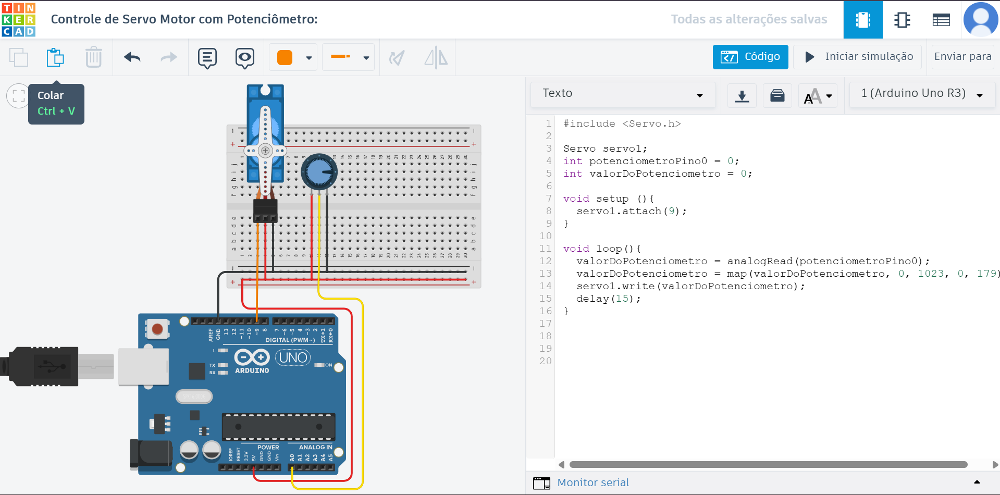
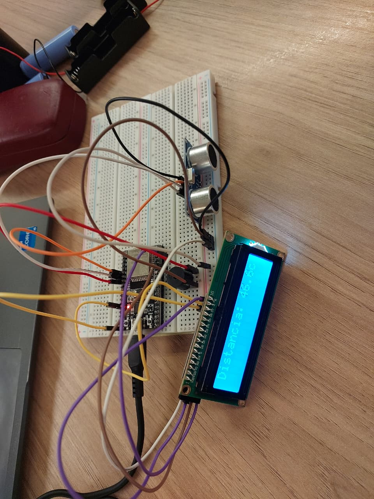

# IoT - Módulo 1 - Aula 4

Nesta aula são apresentados sensores digitais e analógicos, métodos básicos de aquisição e processamento de sinais, e técnicas para exibir resultados em displays. Foram desenvolvidos dois projetos complementares: uma simulação no Tinkercad demonstrando o controle de um servo por potenciômetro e um protótipo físico com sensor ultrassônico, display LCD e buzzer para medição e alerta de proximidade. Os exemplos percorrem desde a leitura de entradas até o tratamento dos dados e a interação com atuadores e interfaces de visualização.

---

## Projeto 1: Simulação Tinkercad - Controle de Servo Motor com Potenciômetro

**Código:** [`servo.ino`](servo.ino)

### Descrição
Simula o controle de um servo motor utilizando um potenciômetro. O valor lido do potenciômetro é convertido em um ângulo para o servo, permitindo controlar sua posição manualmente.

- **Potenciômetro:** Permite variar manualmente o valor lido pelo Arduino.
- **Servo Motor:** Gira conforme o valor do potenciômetro.
- **Plataforma:** Tinkercad (simulação).

### Funcionalidades
- Controle preciso do ângulo do servo motor via potenciômetro.
- Conversão de entrada analógica em movimento físico.

### Como funciona
1. O potenciômetro envia um valor analógico para o Arduino.
2. O valor é convertido para um ângulo entre 0° e 179°.
3. O servo motor gira para o ângulo correspondente.

### Imagem do circuito no Tinkercad

---

## Projeto 2: Protótipo Físico - Medidor de Distância com Alarme

**Código:** [`sensor.ino`](sensor.ino)

### Descrição
Protótipo físico de um medidor de distância com sensor ultrassônico, display LCD e buzzer para alerta de proximidade.

- **Sensor Ultrassônico (HC-SR04):** Mede a distância até obstáculos.
- **Display LCD I2C:** Exibe a distância em tempo real.
- **Buzzer:** Emite alerta sonoro se a distância for menor que 10 cm.

### Funcionalidades
- Exibe a distância no LCD.
- Alerta sonoro quando objeto está próximo.
- Mensagem de alerta no display.

### Como funciona
1. O sensor mede a distância e envia o valor ao Arduino.
2. O LCD mostra a distância.
3. Se a distância for menor que 10 cm, o buzzer é acionado e o LCD exibe "ALERTA! PROXIMO".

### Imagem do protótipo físico

### Vídeo de demonstração
<video src="sensorai.mp4" controls width="400">Seu navegador não suporta vídeo incorporado. <a href="sensorai.mp4">Clique aqui para baixar o vídeo</a>.</video>

Caso o vídeo acima não carregue, assista pelo YouTube: [Ver vídeo no YouTube](https://youtu.be/CuEKeSfHHhw)

---

## Referências dos Códigos

- [`servo.ino`](servo.ino): Simulação Tinkercad.
- [`sensor.ino`](sensor.ino): Protótipo físico.

---
